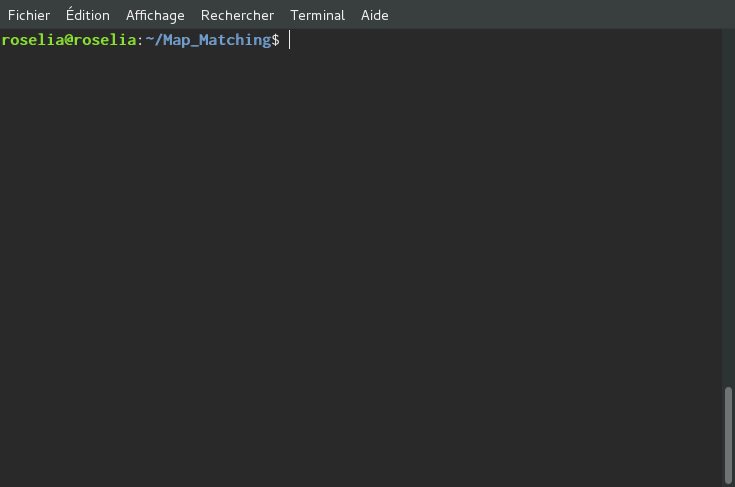

# How to use the docGenerator tool ?

docGenerator is a little script to launch doxygen from sources (which are in the developping branch) to generate documentation and put it in the gh-pages branch (hosted website on github server). This way everyone has access to the documentation.

